# Parallax mapping

This project delves into the application of parallax mapping, a technique that transforms 2D objects into convincing 3D representations. A modified approach to the conventional parallax mapping method is introduced and objectively compared in the initial scene. Additionally, the project includes a detailed showcase scene named *The Parallax at Dawn* where the proposed method is demonstrated.

## Implementation
The project incorporates various parallax mapping techniques, providing a comprehensive understanding:

 1. ***Parallax mapping with offset limiting***
 2. ***Steep parallax mapping***
 3. ***Parallax occlusion mapping***
 4. ***Proposed Modification of Parallax Occlusion Mapping (improved using a binary search)***

The proposed method (4.) employs linear steep Parallax steps to approximate texture displacement (line B in the Image 1.[^1] connects this approximation with previous step). This approximation is refined through a binary search applied on the vector B (the stopping criteria is dependent on the squared norm of the distance of the two texture coordinates), followed by linear interpolation similar to Parallax Occlusion Mapping. See Image 1. for a visual representation.

<p align="center">
  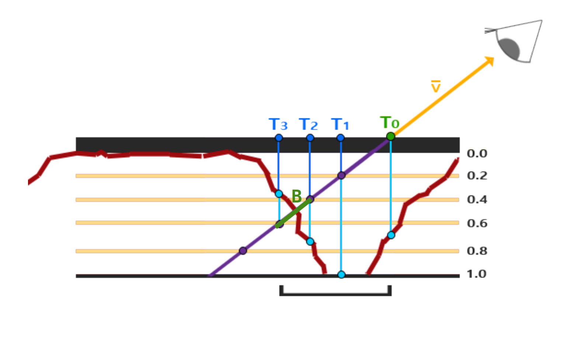
  <br>
  <em>1. Image showing the modified Parallax Occlusion Mapping.</em>
</p>

[^1]: The original non-modified image can be found at [learnopengl](https://learnopengl.com/img/advanced-lighting/parallax_mapping_steep_parallax_mapping_diagram.png)


### Method comparisons

In summary, the parallax occlusion mapping method with binary search is superior in handling the "wrinkle" artifacts along the horizontal axis compared to the vertical axis when compared to the parallax occlusion mapping method. Conversely, the latter proves more effective in managing vertical axis artifacts than its binary search counterpart. However, the differences between the methods are not too notable. The table below provides a detailed comparison of these methods, each executed with a consistent 20 iterations (notably, the binary search method utilizes 12 layer iterations and 8 binary search iterations).

| Method               | Distance               | Closeup               |
| ---------------------- | ---------------------- | ---------------------- |
| (4.) Parallax occlusion mapping with Binary search                | 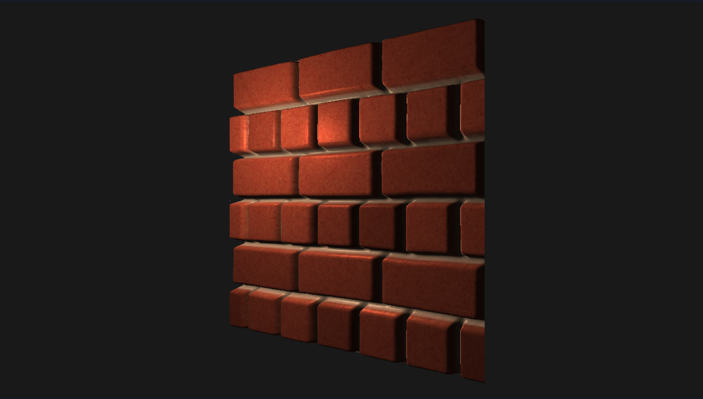 | 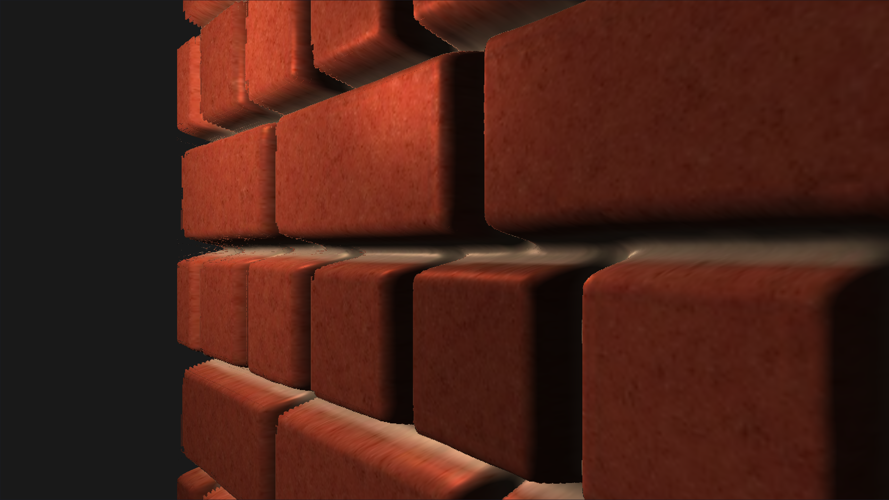 |
| (3.) Parallax occlusion mapping| 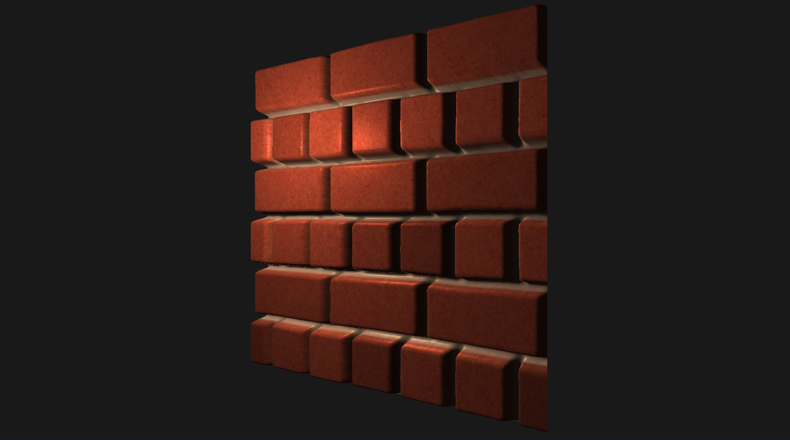 | 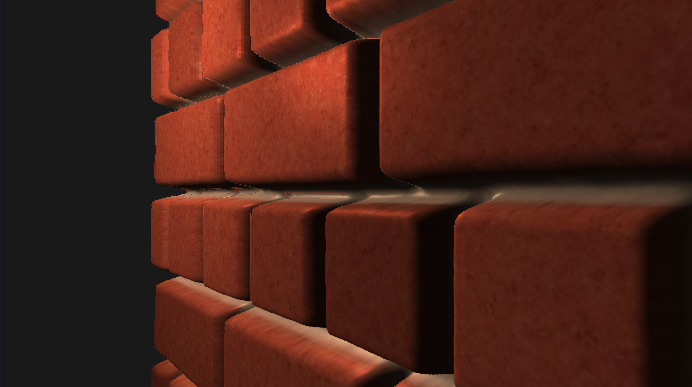 |
| (2.) Steep parallax mapping| 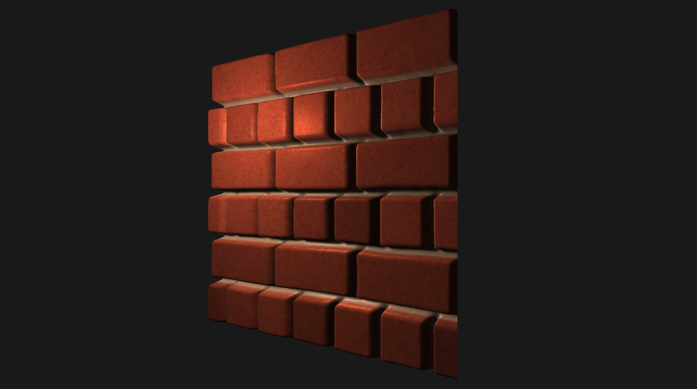 | 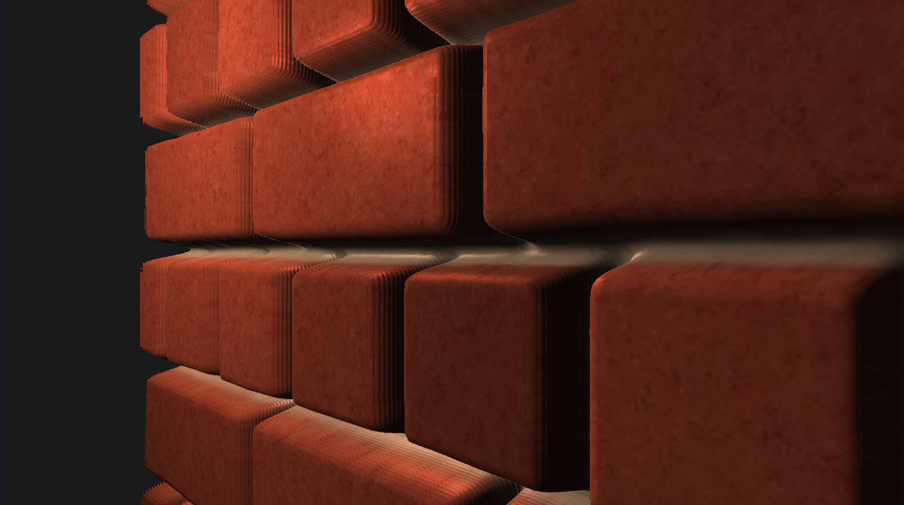 |
| (1.) Parallax mapping with offset limiting| 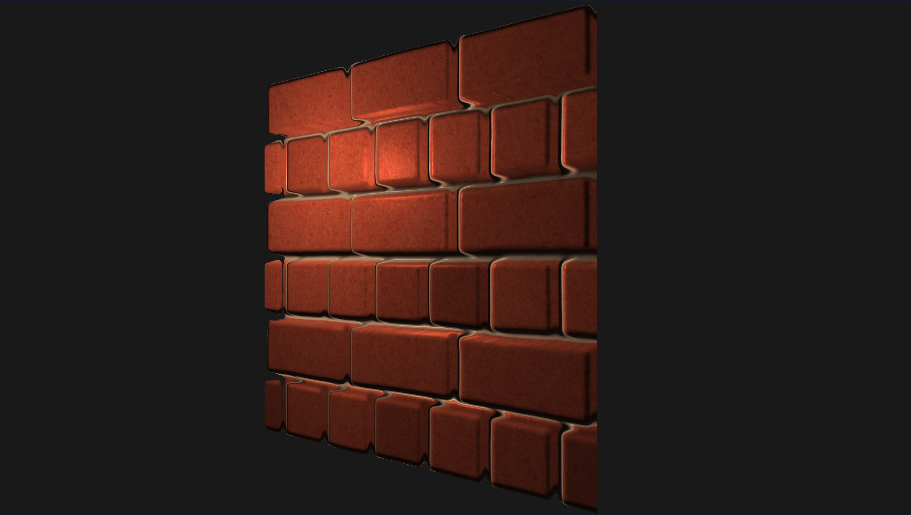 | 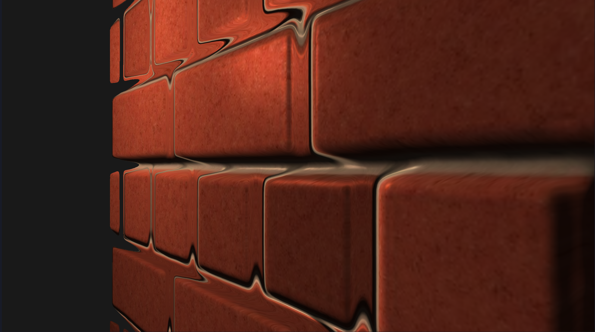 |
| Normal mapping| 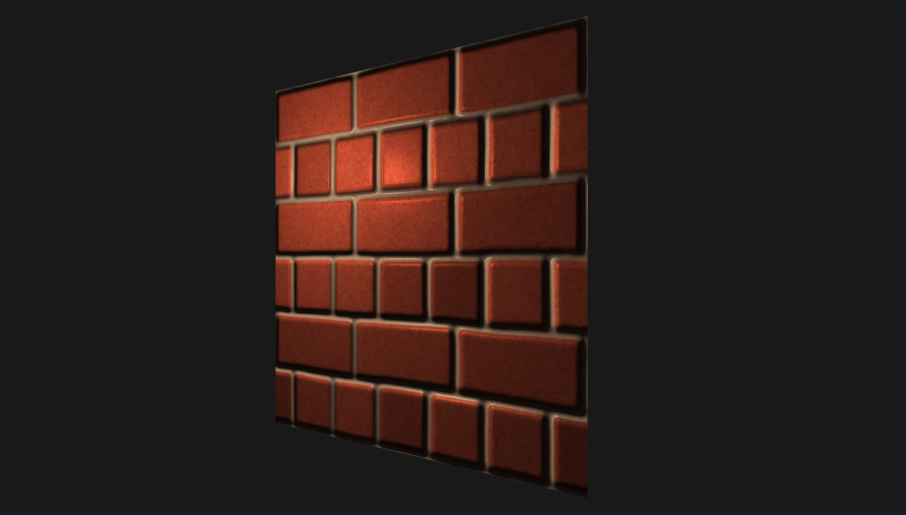 | 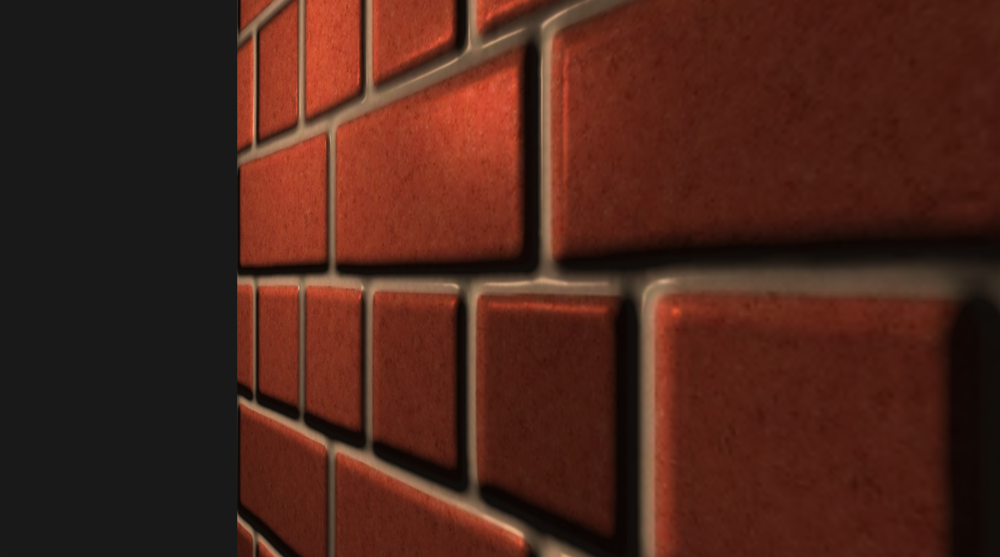 |
| Diffuse texture only| 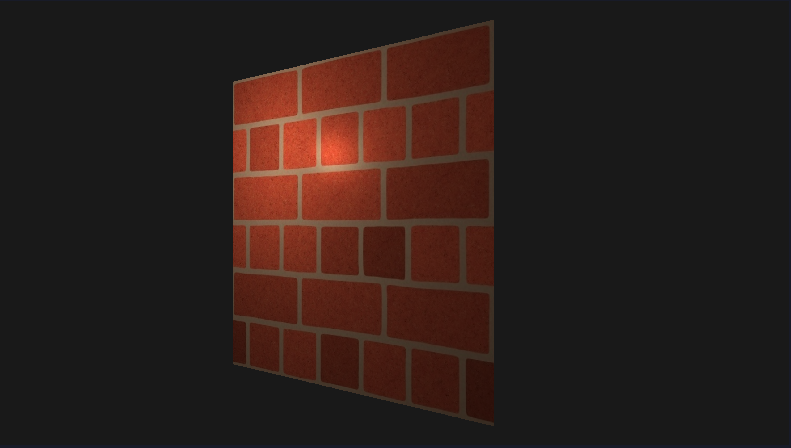 | 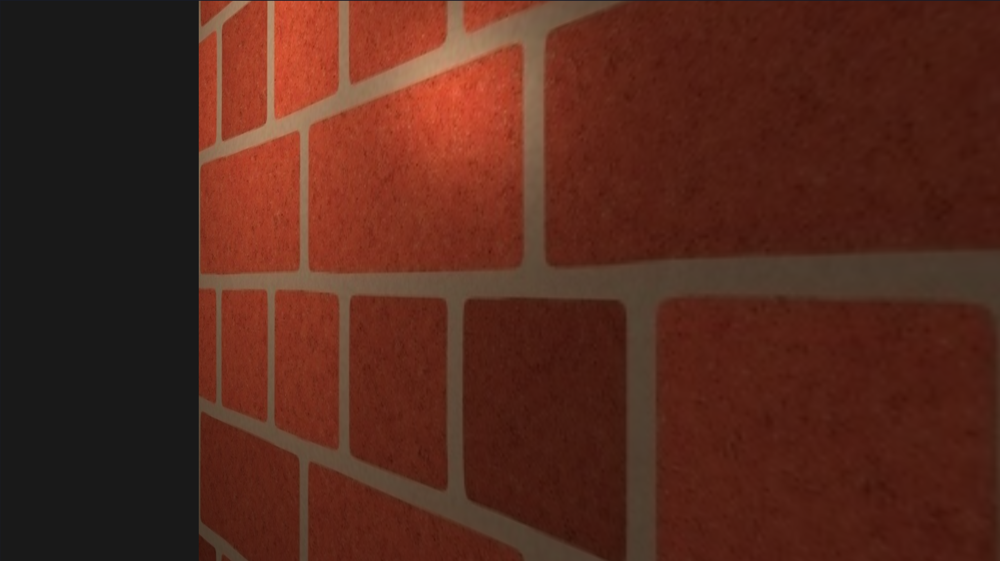 |


## Scene: The Parallax at Dawn

The showcase scene features three distinct ground textures - rocky path, dirt, and jungle path. Each texture integrates diffuse maps, normal maps, and displacement maps. Texture displacement is calculated using the proposed binary search parallax occlusion method. The scene serves as a demonstration of the refined method's capabilities, showcasing an interplay of textures, lighting, and environment for a visually immersive experience.

#### Additional Elements:
 * **House model:** Imported as a .obj file, the house integrates a diffuse map and a normal map to accentuate its features.
 
 *Note: The implemented .obj and .ppm loader loads the file, computes tangents and bitangents, and uses a Gram–Schmidt process for orthogonalizing the tangent-space-basis.*
 * **Camera Movement:** The scene incorporates a moving first-person camera for a dynamic viewing experience.

#### Lighting and Environment:

 * **Phong Model Lighting:** The scene is illuminated using a Phong lighting model with attenuation, although the attenuation is not utilized in this scene.
 * **Skybox:** The skybox is rendered using a cube map, contributing to the environment.

| The Parallax at Dawn               | Wireframe mode               |
| ---------------------- | ---------------------- |
| 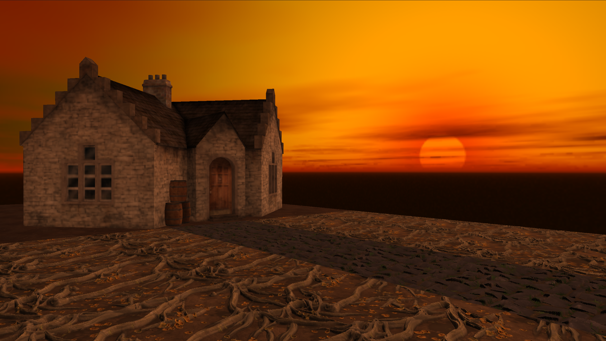 | 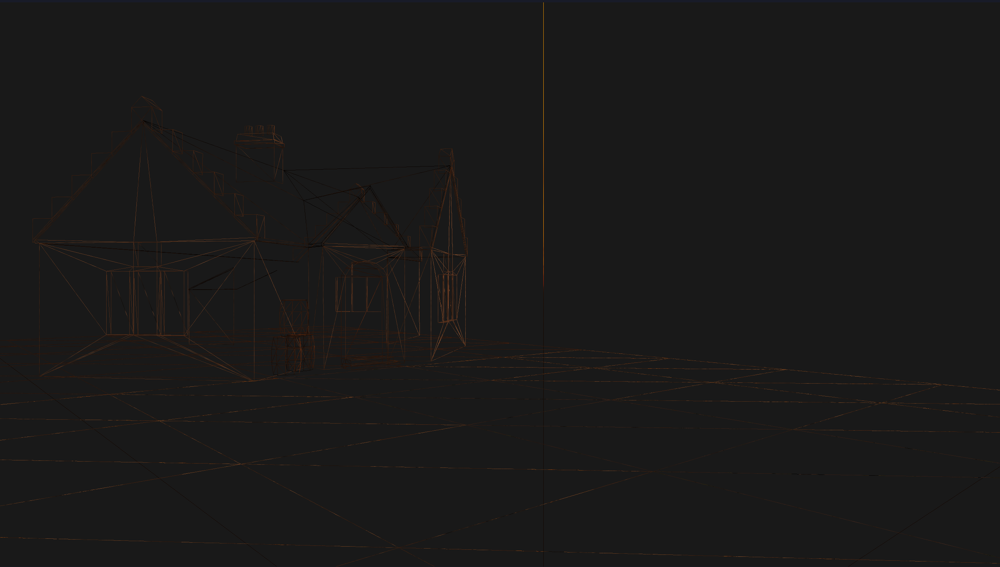
## Setup

The project includes a python build file that compiles the project into a binary *prog*. To run the program thus:
```
python3 build.py && ./prog
```

The default scene is *the Parallax at Dawn*, to render the scene with brick wall comparisons uncomment [this line](https://github.com/Fall23Graphics/finalproject-adams-team/blob/d084451d87c664aa9dd9c76684ac43d8468bde28/Parallax_Mapping/src/main.cpp#L248).

## YouTube/Dropbox/Drive Link: Edit this line -- Put your link to your video(Preferably on YouTube) here (see deliverables)
[Parallax Mapping Video](https://youtu.be/b_eStRV7Zlw)

## Project information

* Name and partners name(At most teams of 2 folks total)
  * Team member 1: Adam Bosak
* How many hours did it take you to complete this final project? 60 hours
* Did you collaborate or share ideas with any other students/TAs/Professors? I asked Mike if the project is a good idea.
* Did you use any external resources? 
  * Note it is fair to utilize some tutorials--cite them here. You **must** add your own personal touch however!
  * [Parallax mapping](https://learnopengl.com/Advanced-Lighting/Parallax-Mapping)
  * [Cubemaps](https://learnopengl.com/Advanced-OpenGL/Cubemaps)

### Rubric

<table>
  <tbody>
    <tr>
      <th>Points</th>
      <th align="center">Description</th>
    </tr>
    <tr>
      <td>(30%) Project Completion</td>
     <td align="left"><ul><li>(10%) Does the project compile and run.</li><li>Is it polished without any bugs (No weird visual artifacts).</li><li>(15%)Did you make a video?</li><li>(5%)Did you add a screenshot of your project to the repository?</li></ul></td>
    </tr>
    <tr>
      <td>(40%) Technical</td>
      <td align="left"><ul><li>Was the implementation of the project challenging?</li><li>Even if you followed a tutoral, it should not be trivial, and have some personal touch to it.</li><li>Did you have to organize/process a sufficient amount of data?</li><li>Was it clear you consulted some outside resources that go above and beyond the scope of this class</li></ul></td>
    </tr>
    <tr>
      <td>(30%) Creativity</td>
      <td align="left"><ul><li>How visually appealing is the scene?<ul><li>Note: There should be some 'wow' factor--instructors discretion is used here relative to previous projects.</li></ul></li><li>How original is the project<ul><li>Again, did you enhance a tutorial and do something unique or just go by the book?</li></ul></li></ul></td>
    </tr>
  </tbody>
</table>
